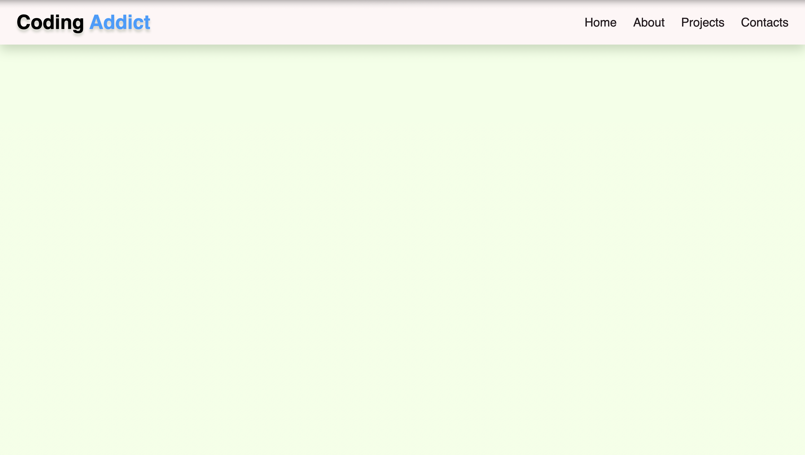

<div align="center">
  <h2 align="center">Responsive Navbar</h2>

  This is a Navbar for all websites, <br />Responsive for all devices, built using HTML, CSS, and JavaScript.

  <a href="https://rolandaayo.github.io/responsive-navbar/"><strong>➥ Live Demo</strong></a>

</div>

<br />

### Demo Screeshots



### Prerequisites

Before you begin, ensure you have met the following requirements:

* [Git](https://git-scm.com/downloads "Download Git") must be installed on your operating system.

### Installing Navbar

To install **Responsive Navbar**, run this command on your git bash:

Linux and macOS:

```bash
sudo git clone https://github.com/rolandaayo/responsive-navbar.git
```

Windows:

```bash
git clone https://github.com/rolandaayo/responsive-navbar.git
```

### Contact

If you want to contact with me you can reach me at [Twitter](https://www.twitter.com/rolandaayo).

### License

This project is **free to use** and does not contains any license.
